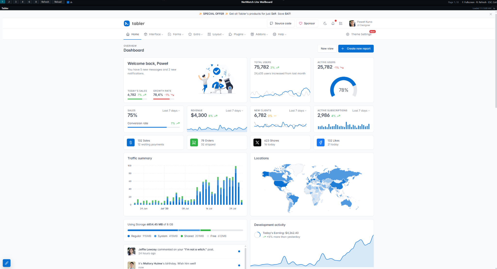
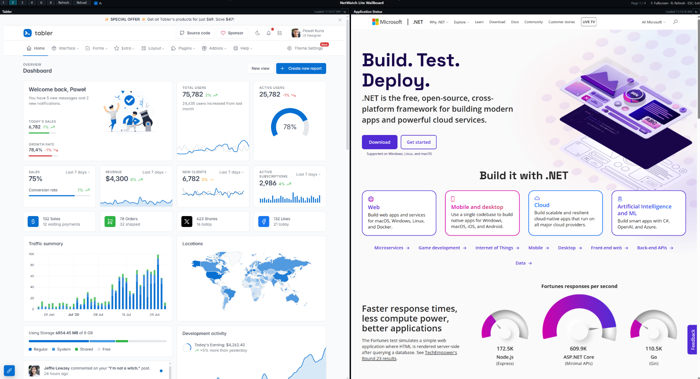
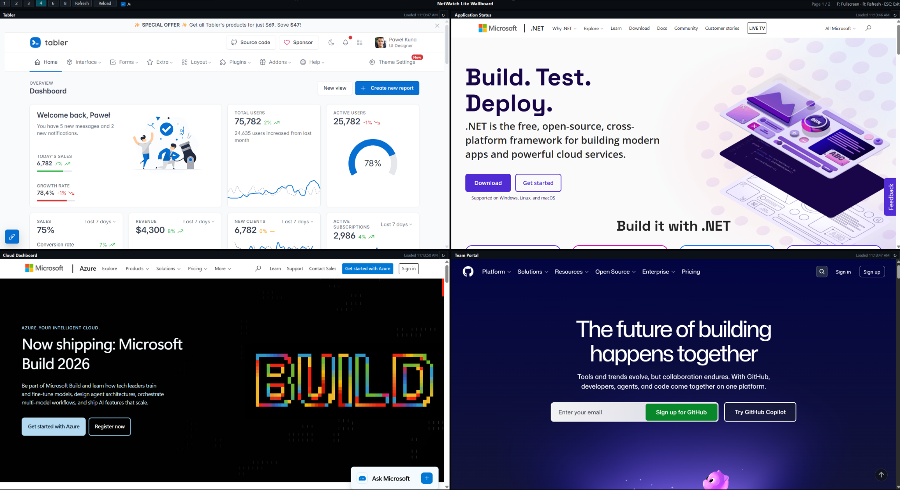

# NetWatch Lite Wallboard

NetWatch Lite Wallboard is a Windows NOC-style desktop wallboard built with .NET 8, WinForms, and Microsoft Edge WebView2.

It renders multiple monitoring pages as native WebView2 browser panels. This avoids the iframe restrictions that many operational pages enforce with `X-Frame-Options` or `Content-Security-Policy`.

GitHub repository: [https://github.com/dafermen/netwatch-lite-wallboard](https://github.com/dafermen/netwatch-lite-wallboard)

## Screenshots

NetWatch Lite Wallboard is designed for operations rooms, TVs, and support teams that need several live pages visible at the same time.

### 1 Panel Focus Mode

Use this layout when one application or dashboard needs full attention.



### 2 Panel Split View

Use this layout to compare two operational systems side by side.



### 4 Panel NOC View

Use this layout for a classic wallboard view with multiple web applications on one screen.



## Features

- Native Windows executable.
- Embedded Windows executable icon for portable builds.
- Microsoft Edge WebView2 per panel.
- JSON-driven configuration.
- 1, 2, 3, 4, 6, and 8 panel layouts.
- Automatic page rotation.
- Independent refresh interval per panel.
- Manual refresh for visible panels.
- Individual refresh button per panel.
- Fullscreen mode for NOC/TV displays.
- Keyboard shortcuts:
  - `F`: toggle fullscreen.
  - `R`: refresh visible panels.
  - `ESC`: exit fullscreen.
- Optional root-relative local pages for teams that want to ship static wallboard assets beside the executable.
- Friendly panel-level error display when navigation fails.

## Project Structure

```text
netwatch-lite-wallboard/
├── Assets/
│   └── netwatch-lite.ico
├── Data/
│   └── wallboard.json
├── docs/
│   ├── images/
│   │   ├── wallboard-four-panels.png
│   │   ├── wallboard-one-panel.png
│   │   └── wallboard-two-panels.png
│   └── developer-guide.md
├── src/
│   └── NetWatchLite.Wallboard.WebView2/
│       ├── NetWatchLite.Wallboard.WebView2.csproj
│       ├── Program.cs
│       ├── WallboardConfigReader.cs
│       ├── WallboardConfiguration.cs
│       ├── WallboardForm.cs
│       ├── WallboardPanel.cs
│       └── WebViewPanelControl.cs
├── CHANGELOG.md
├── LICENSE
└── README.md
```

## Configuration

The application reads `wallboard.json` from the same folder as `NetWatch-Lite-Wallboard.exe`. During development, it falls back to `Data/wallboard.json`.

```json
{
  "appTitle": "NetWatch Lite Wallboard",
  "rotationEnabled": true,
  "rotationSeconds": 20,
  "defaultLayout": 4,
  "panels": [
    {
      "name": "Operations Overview",
      "url": "https://example.com/",
      "refreshSeconds": 10
    },
    {
      "name": "Application Status",
      "url": "https://dotnet.microsoft.com/",
      "refreshSeconds": 12
    }
  ]
}
```

Panel URLs can be:

- Absolute HTTP/HTTPS URLs.
- Root-relative local URLs when you add your own static files beside the executable, for example `/status/index.html`.

## Requirements

- Windows 10 or later.
- .NET 8 SDK for development.
- Microsoft Edge WebView2 Runtime on the target machine.

Most modern Windows systems already include the WebView2 Runtime. If not, install the Evergreen WebView2 Runtime from Microsoft.

## Build And Run

```powershell
dotnet restore
dotnet build
dotnet run --project .\src\NetWatchLite.Wallboard.WebView2\NetWatchLite.Wallboard.WebView2.csproj
```

## Portable Download

A Windows x64 portable ZIP is available in the repository:

[Download NetWatch Lite Wallboard portable ZIP](https://raw.githubusercontent.com/dafermen/netwatch-lite-wallboard/main/releases/NetWatch-Lite-Wallboard-WebView2-win-x64-2026-05-07-ee2d168.zip)

Extract the ZIP on Windows and run `NetWatch-Lite-Wallboard.exe`. The editable `wallboard.json` file is included beside the executable. Use the direct download link above instead of saving the GitHub preview page as a ZIP file.

The ZIP should be about 67 MB. If the downloaded file is about 220 KB, the browser saved a GitHub HTML page instead of the portable ZIP. Use the direct link above or download from a terminal:

```powershell
curl.exe -L -o NetWatch-Lite-Wallboard-WebView2-win-x64.zip "https://raw.githubusercontent.com/dafermen/netwatch-lite-wallboard/main/releases/NetWatch-Lite-Wallboard-WebView2-win-x64-2026-05-07-ee2d168.zip"
```

## Publish Portable Build

```powershell
dotnet publish .\src\NetWatchLite.Wallboard.WebView2\NetWatchLite.Wallboard.WebView2.csproj `
  -c Release `
  -r win-x64 `
  --self-contained true `
  -p:PublishSingleFile=false `
  -o .\publish\wallboard-webview2-win-x64
```

Expected output:

```text
publish/wallboard-webview2-win-x64/
├── NetWatch-Lite-Wallboard.exe
├── wallboard.json
└── runtime dependencies...
```

Run:

```powershell
.\NetWatch-Lite-Wallboard.exe
```

Edit `wallboard.json` beside the executable to change panels without recompiling.

## License

NetWatch Lite Wallboard is released under the [MIT License](LICENSE). You can use, copy, modify, merge, publish, distribute, sublicense, and sell copies of the software under the license terms.

## Operational Notes

- Use `defaultLayout: 1` for one large focus panel.
- Use `defaultLayout: 2` or `3` for large side-by-side panels.
- Use `defaultLayout: 4` for 2x2 NOC screens.
- Use `defaultLayout: 6` or `8` for dense TV or ultrawide monitoring walls.
- Keep `refreshSeconds` reasonable for internal monitoring pages.
- WebView2 loads pages as native browser views, so pages that fail inside iframe-based dashboards usually work here.
- Some authentication flows may still require interactive login in the WebView2 session.
