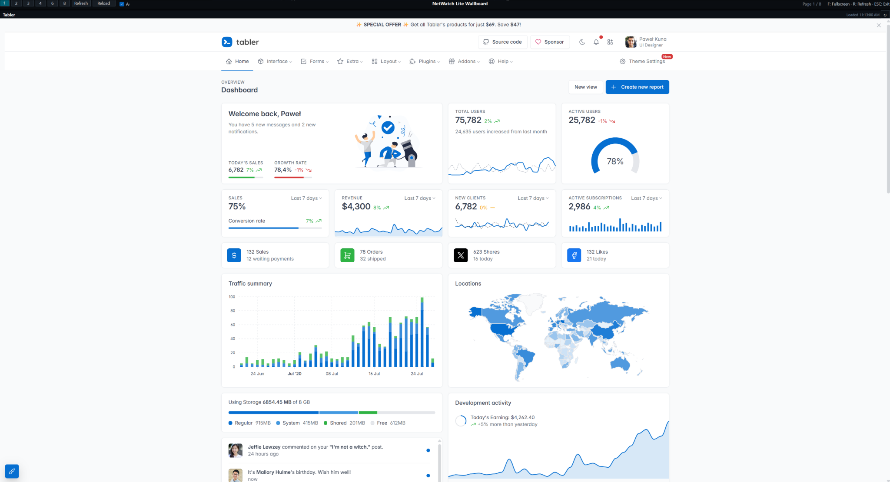
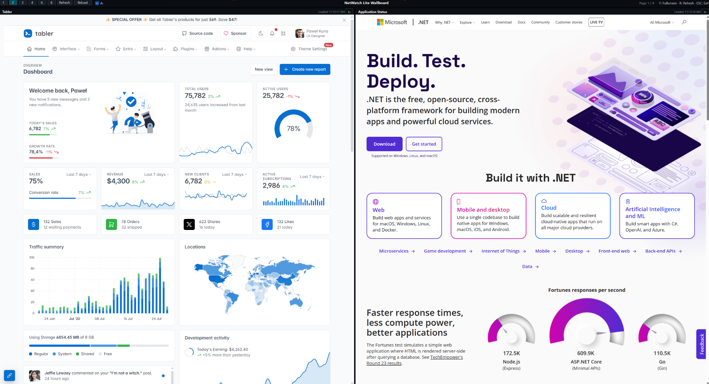
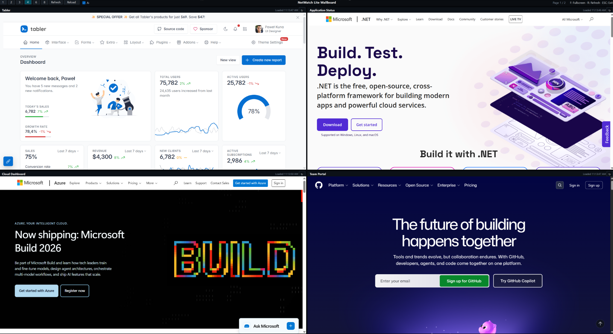

# NetWatch Lite Wallboard

NetWatch Lite Wallboard is a Windows desktop wallboard for support teams, NOC rooms, shared workstations, and TV displays.

It is built with .NET 8, WinForms, and Microsoft Edge WebView2. Each panel is a real embedded browser view, so operational pages that refuse iframe embedding usually work here.

GitHub repository: [https://github.com/dafermen/netwatch-lite-wallboard](https://github.com/dafermen/netwatch-lite-wallboard)

## Current Scope

This project is now focused on displaying and refreshing web pages. It does not scrape web pages, inspect DOM elements, run selector rules, or trigger alarms from page content.

The application is intentionally simple:

- Load dashboards and operational URLs.
- Arrange them into wallboard layouts.
- Refresh each panel on its own timer.
- Rotate through pages when there are more panels than visible slots.
- Restart one panel or all panels when a WebView needs a clean reload.
- Restart visible panels automatically every configured number of hours.
- Reduce memory use while minimized with low-power mode.
- Show a lightweight memory indicator with restart recommendation.
- Start in fullscreen kiosk mode and confirm before closing.
- Auto-hide the top bar for TV displays.
- Use dark, light, or high-contrast native shell themes.
- Edit configuration through a visual settings window.

## Features

- 1, 2, 3, 4, 6, and 8 panel layouts.
- Independent WebView2 instance per visible panel.
- Independent refresh interval per panel.
- Manual **Refresh All** action for all visible panels.
- Restart button per panel.
- Restart all visible panels from the top bar.
- Optional auto-rotation.
- Optional low-power mode while minimized.
- Visual settings editor for `wallboard.json`.
- Import and export configuration from the settings window.
- Runtime diagnostics window.
- Environment profiles such as `wallboard.demo.json` and `wallboard.production.json`.
- Portable Windows publish script.

## Screenshots

### 1 Panel Focus Mode



### 2 Panel Split View



### 4 Panel NOC View



## Quick Start

Requirements:

- Windows 10 or later.
- .NET 8 SDK for development.
- Microsoft Edge WebView2 Runtime on the target machine.

Run from source:

```powershell
cd C:\Projects\netwatch-lite-wallboard
dotnet run --project .\src\NetWatchLite.Wallboard.WebView2\NetWatchLite.Wallboard.WebView2.csproj
```

Run with an environment profile:

```powershell
dotnet run --project .\src\NetWatchLite.Wallboard.WebView2\NetWatchLite.Wallboard.WebView2.csproj -- --environment demo
```

## Build

```powershell
cd C:\Projects\netwatch-lite-wallboard
dotnet restore
dotnet build
```

## Publish Portable

Create a portable Windows x64 folder and ZIP:

```powershell
cd C:\Projects\netwatch-lite-wallboard
.\scripts\publish-portable.ps1
```

Create only the folder, without ZIP:

```powershell
.\scripts\publish-portable.ps1 -NoZip
```

Expected output:

```text
publish/NetWatch-Lite-Wallboard-WebView2-win-x64-v{version}/
|-- NetWatch-Lite-Wallboard.exe
|-- wallboard.json
|-- wallboard.demo.json
|-- wallboard.production.json
|-- README.md
|-- LICENSE
`-- runtime dependencies...
```

## Configuration

The application reads `wallboard.json` from the executable folder. During development, it falls back to `Data/wallboard.json`.

Example:

```json
{
  "appTitle": "NetWatch Lite Wallboard",
  "rotationEnabled": false,
  "rotationSeconds": 90,
  "defaultLayout": 4,
  "lowPowerModeEnabled": true,
  "autoRestartEnabled": false,
  "autoRestartHours": 6,
  "startFullscreen": false,
  "confirmExit": false,
  "memoryMonitorEnabled": true,
  "memoryWarningMegabytes": 1500,
  "autoHideTopBarEnabled": false,
  "theme": "dark",
  "panels": [
    {
      "name": "Operations Overview",
      "url": "https://example.com/",
      "refreshSeconds": 60
    },
    {
      "name": "Incident Queue",
      "url": "https://example.org/",
      "refreshSeconds": 60
    }
  ]
}
```

Top-level fields:

| Field | Type | Description |
|---|---|---|
| `appTitle` | string | Text shown in the top bar. |
| `rotationEnabled` | boolean | Enables automatic page rotation. |
| `rotationSeconds` | number | Seconds between rotations. |
| `defaultLayout` | number | Visible panel count. Supported values: `1`, `2`, `3`, `4`, `6`, `8`. |
| `lowPowerModeEnabled` | boolean | Releases visible panels while the app is minimized. |
| `autoRestartEnabled` | boolean | Restarts visible panels on a schedule for long-running sessions. |
| `autoRestartHours` | number | Hours between scheduled visible-panel restarts. Valid range: `1` to `24`. |
| `startFullscreen` | boolean | Starts the wallboard in fullscreen mode. |
| `confirmExit` | boolean | Shows a confirmation dialog before closing. |
| `memoryMonitorEnabled` | boolean | Shows memory use and restart recommendation in the top bar. |
| `memoryWarningMegabytes` | number | Memory threshold for the restart recommendation. |
| `autoHideTopBarEnabled` | boolean | Hides the top bar after mouse idle; move the mouse to the top edge to show it. |
| `theme` | string | Native shell theme: `dark`, `light`, or `high-contrast`. |
| `panels` | array | Ordered panel list. |

Panel fields:

| Field | Type | Description |
|---|---|---|
| `name` | string | Panel title. |
| `url` | string | HTTP/HTTPS URL, `file:///` URL, or packaged local path. |
| `refreshSeconds` | number | Refresh interval for that panel. |

## Settings Window

Open settings with the top-bar **Settings** button or press `C`.

The settings window lets you:

- Change the wallboard title.
- Enable or disable rotation.
- Change the rotation interval.
- Choose the default layout.
- Enable or disable low-power mode.
- Configure scheduled panel restart.
- Configure fullscreen startup and close confirmation.
- Configure memory monitor and warning threshold.
- Enable or disable top-bar auto-hide.
- Choose dark, light, or high-contrast theme.
- Add, edit, duplicate, delete, and reorder panels.
- Import and export JSON configuration.
- Open diagnostics.
- Save changes back to the active JSON file.

When saving, the app creates a backup of the previous JSON file, writes through a temporary file, verifies the saved content, and reloads the wallboard.

## Environment Profiles

Profiles use files named `wallboard.{environment}.json`.

Examples:

- `wallboard.demo.json`
- `wallboard.production.json`

Run a profile from source:

```powershell
dotnet run --project .\src\NetWatchLite.Wallboard.WebView2\NetWatchLite.Wallboard.WebView2.csproj -- --environment production
```

Run a profile from a portable build:

```powershell
.\NetWatch-Lite-Wallboard.exe --environment production
```

You can also set:

```powershell
$env:NETWATCH_WALLBOARD_ENV = "production"
```

## Keyboard Shortcuts

| Key | Action |
|---|---|
| `F` | Toggle fullscreen. |
| `R` | Refresh visible panels. |
| `C` | Open settings. |
| `ESC` | Exit fullscreen, or close the app when fullscreen is not active. |

## Project Structure

```text
netwatch-lite-wallboard/
|-- Assets/
|   `-- netwatch-lite.ico
|-- Data/
|   |-- wallboard.json
|   |-- wallboard.demo.json
|   `-- wallboard.production.json
|-- docs/
|   |-- developer-guide.md
|   |-- user-guide.md
|   `-- images/
|-- scripts/
|   `-- publish-portable.ps1
|-- src/
|   `-- NetWatchLite.Wallboard.WebView2/
|-- CHANGELOG.md
|-- AGENTS.md
|-- CURRENT_STATUS.md
|-- LICENSE
|-- netwatch-lite-wallboard.slnx
`-- README.md
```

## Documentation

- [User guide](docs/user-guide.md): how to run, configure, and operate the wallboard.
- [Developer guide](docs/developer-guide.md): how the code works, written for a junior developer.
- [Codex instructions](AGENTS.md): required guidance for future Codex sessions.
- [Current status](CURRENT_STATUS.md): project phase, completed work, validation state, and next steps.
- [Changelog](CHANGELOG.md): release history and pending changes.

## Operational Notes

- Use `defaultLayout: 1` for a single focus dashboard.
- Use `defaultLayout: 4` for a classic 2x2 NOC view.
- Use `defaultLayout: 6` or `8` for dense TV walls.
- Keep refresh intervals reasonable for internal systems.
- WebView2 stores browser profile data under `%LOCALAPPDATA%\NetWatchLite\WallboardWebView2`.
- Error logs are written under `%LOCALAPPDATA%\NetWatchLite\WallboardLogs`.

## License

NetWatch Lite Wallboard is released under the [MIT License](LICENSE).
